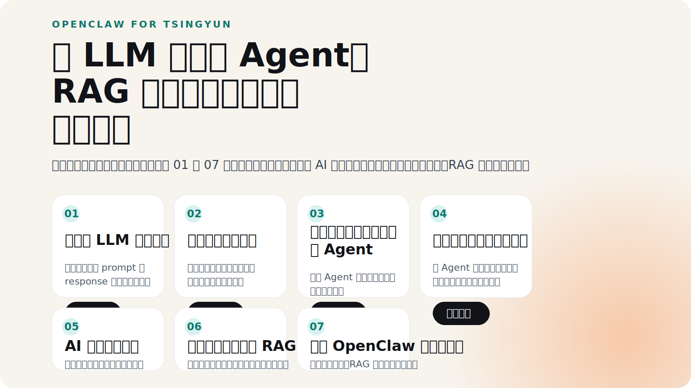

# AI深入浅出小龙虾

一套面向公司内部演示的渐进式 AI / Agent Demo 仓库。项目围绕 “从 LLM 问答，到多轮记忆、工具调用、联网搜索、RAG，再到模拟 OpenClaw 综合工作台” 逐步展开，适合作为培训演示、能力讲解和场景化展示的完整样板。



## 这套仓库适合做什么

- 向业务或管理同学演示 AI 能力是如何一步步升级的
- 在一次分享里串起 `LLM`、`Agent`、`RAG`、自动化与综合工作台
- 作为内部 Demo 底座，继续扩展行业场景、企业知识库和自动化流程
- 用于现场演示、录屏讲解和培训答疑

## 项目结构

- `portal`
  演示总入口，默认端口 `8100`
- `projects/01-basic-qa`
  最基础的 LLM 一问一答，默认端口 `8101`
- `projects/02-memory-chat`
  带上下文记忆的多轮对话，默认端口 `8102`
- `projects/03-file-agent`
  调本地工具写文件的 Agent，默认端口 `8103`
- `projects/04-search-to-html`
  联网搜索并生成网页报告，默认端口 `8104`
- `projects/05-mobile-openclaw`
  模拟综合工作台，集成看图、联网、记忆与任务处理，默认端口 `8105`
- `projects/06-ai-news-push`
  AI 资讯获取与推送，默认端口 `8106`
- `projects/07-ai-rag`
  文档上传与知识库问答，默认端口 `8107`

## 技术栈

- Python
- FastAPI
- Jinja2
- SQLite

## 本地启动

### 启动全部服务

```powershell
.\launch_all.ps1
```

默认访问地址：

- Portal: `http://127.0.0.1:8000/`
- 局域网访问时，将 `127.0.0.1` 替换为实际 IP

### Android APK

Android 工程目录：

- `android-openclaw-webview`

构建 release APK：

```powershell
cd D:\1-workspace\6-ai\openclaw-dev\android-openclaw-webview
D:\3-env\gradle-8.5\bin\gradle.bat --no-daemon assembleRelease -POPENCLAW_BASE_URL=http://172.24.0.5:8105
```

APK 输出位置：

- `android-openclaw-webview/app/build/outputs/apk/release/app-release.apk`
- `portal/static/download/🦞小清虾.apk`

## Docker 与 Harbor

### 主要文件

- `Dockerfile`
- `.dockerignore`
- `docker/start_app.py`
- `docker-compose.harbor.yml`
- `harbor.env.example`

### 服务端口

- `8100` -> portal
- `8101` -> 01
- `8102` -> 02
- `8103` -> 03
- `8104` -> 04
- `8105` -> 05
- `8106` -> 06
- `8107` -> 07

### 部署示例

```bash
docker login harbor.tsingyun.net -u admin
docker compose --env-file .env -f docker-compose.harbor.yml pull
docker compose --env-file .env -f docker-compose.harbor.yml up -d
```

## 演示建议

- 按 `01 -> 07` 的顺序讲，最容易让听众理解能力递进
- 先讲“能力边界”，再讲“场景价值”，现场效果会更好
- 如果做对外或高层汇报，建议优先保留 `portal`、`04`、`05`、`07`
